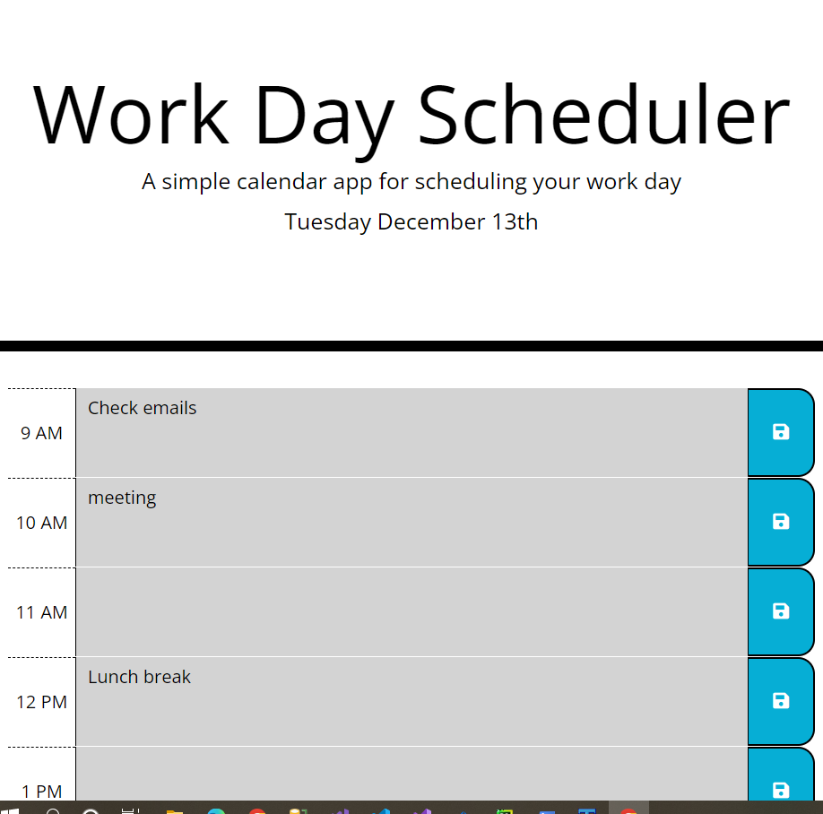
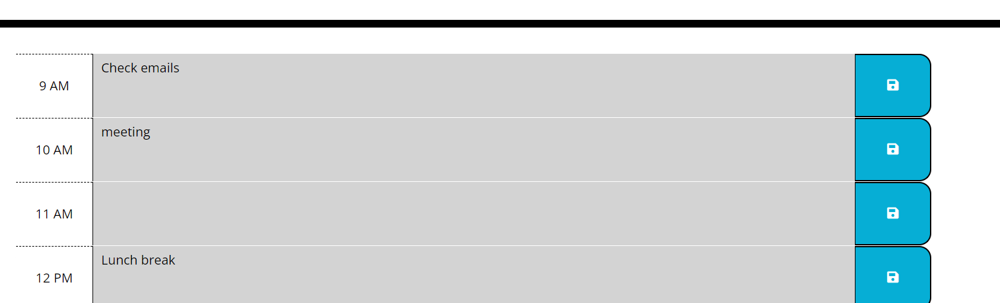
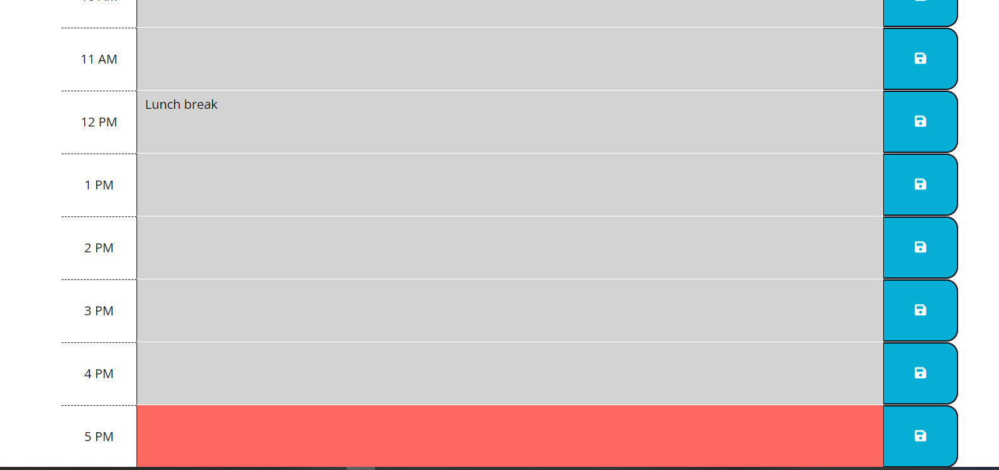
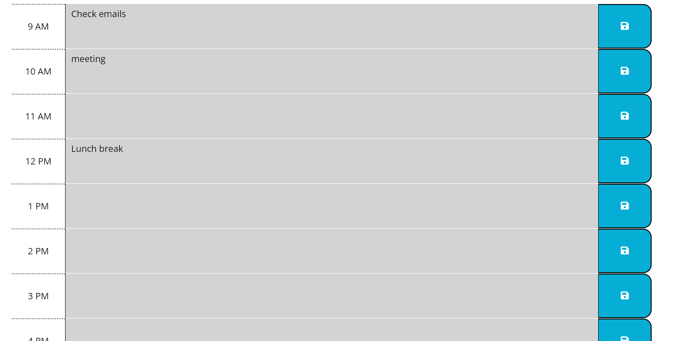

# Work-Day-Schedular
## Description
This is work scheduler application which allows user to schedule their work for every hour.
This application shows work hour from 9am to 5pm.
User can write their schedule in textarea and save this schedule by clicking save button.

## Main Page
Main page looks like this.

Timeblock shows three areas like hour to show office hours, textarea to enter tasks to do and save button to save schedule.

Header area shows current date

Different colors are set for current, past and future hours like red for current, green for future and grey for past hours.

### The URL of the deployed application

https://nandanippani.github.io/Work-Day-Schedular

### The URL of the GitHub repository that contains my code

https://github.com/Nandanippani/Work-Day-Schedular

## Installation

N/A

## Usage

This project is used to demonstrate ability to use functions, return variables, while loop and global variables using Jquery.

## Credits

N/A

## License

Please refer to the LICENSE in the repo.

